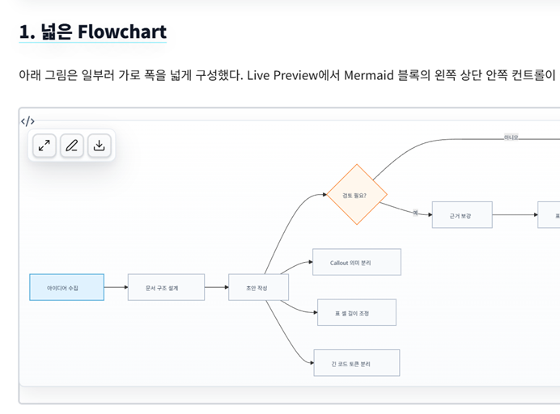
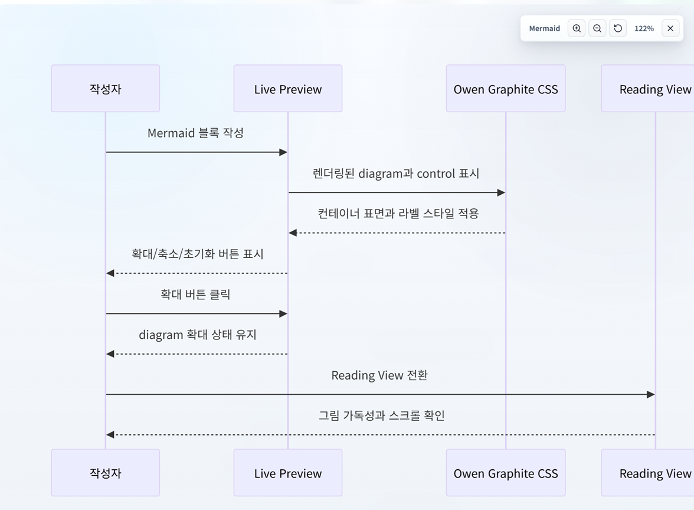
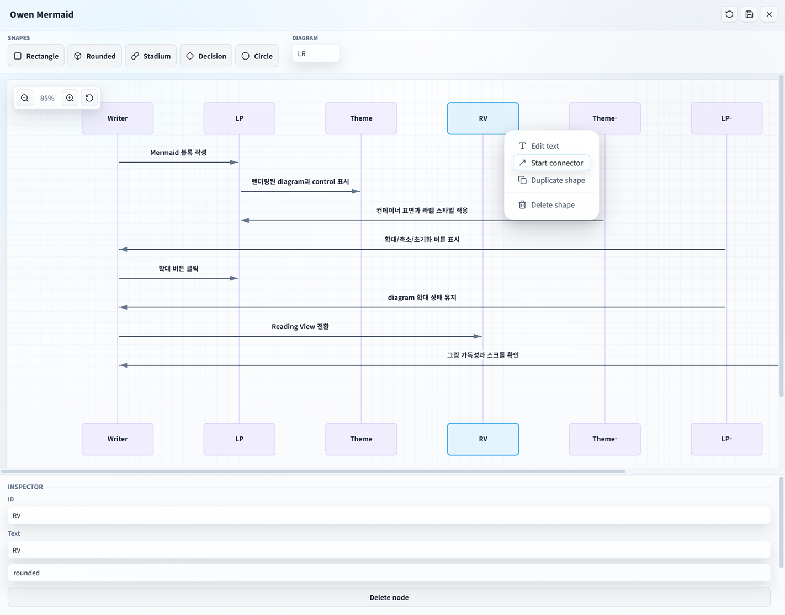
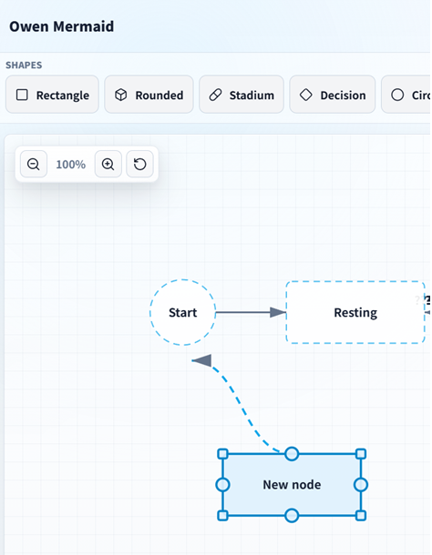
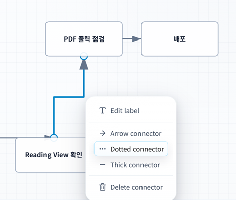
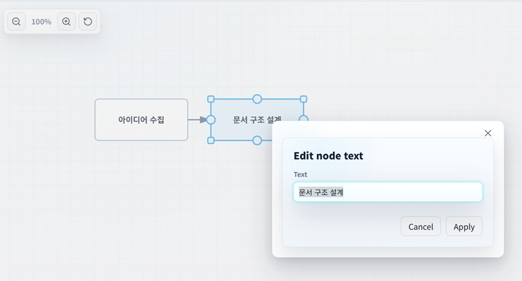
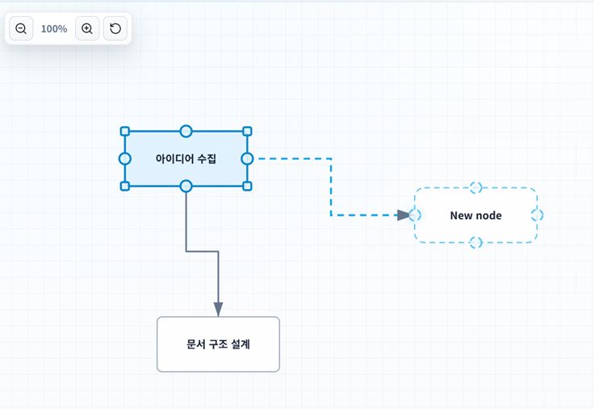
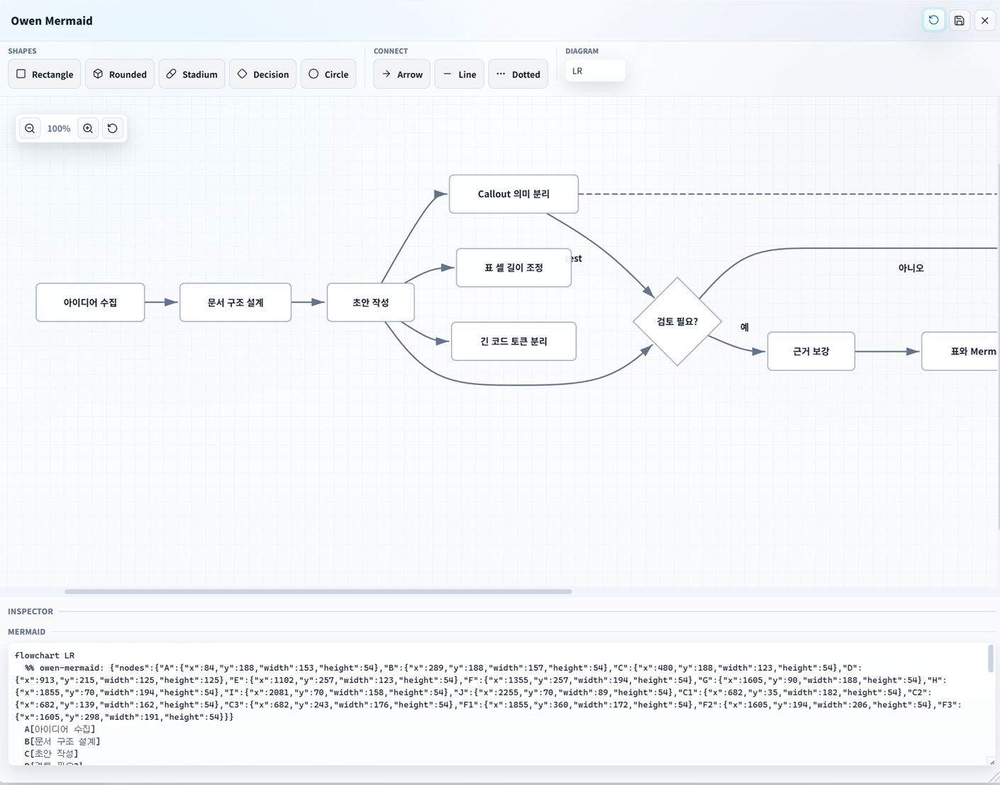
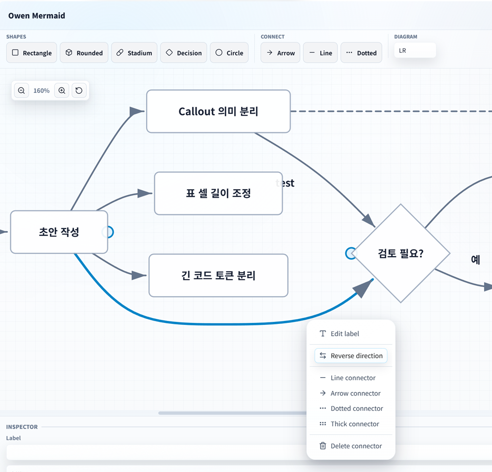

# Owen Mermaid

> [!NOTE]
> **Language:** Owen Mermaid follows Obsidian by default: Korean uses Korean, while every other locale uses English. Override it from **Settings → Owen Mermaid → Interface → Language**.

Owen Mermaid is an Obsidian plugin for viewing and editing Mermaid SVG images inside your notes.

- Detects Mermaid SVG diagrams and adds an inline glass toolbar.
- Adds a Mermaid SVG right-click menu for zoom view, editing, PNG download, and JPG download.
- Provides a full-screen pan and zoom viewer.
- Includes a flowchart-focused visual editor for creating shapes, dragging nodes, editing text, creating/editing/deleting connectors, and writing changes back to the original Mermaid code block.
- Supports PNG/JPG download settings for save location, output folder, filename template, quality, background, and scale.
- Exports all rendered Mermaid SVG diagrams in the active note to a vault folder with an optional Markdown batch report.
- Provides a settings screen with section headers like the screenshot design.
- Supports mouse drag-and-drop Mermaid editing directly on the canvas, similar to working in Visio.
- Applies a liquid glass design tone inspired by Owen Graphite and Owen Editor.

## Screenshots



















## Features

When adding new functionality, add a new row to this table so the current feature surface stays easy to scan.

| Area | Feature | Notes |
| --- | --- | --- |
| Rendered diagrams | Inline glass toolbar | Adds zoom, edit, and image download controls to rendered Mermaid SVG blocks. |
| Rendered diagrams | Context menu actions | Right-click a rendered Mermaid SVG to open zoom, edit, PNG download, or JPG download actions. |
| Zoom viewer | Full-screen pan and zoom | Opens rendered Mermaid SVGs in a large viewer with zoom controls, reset, and drag panning. |
| Visual editor | Flowchart editing | Creates, edits, drags, resizes, duplicates, and deletes common flowchart nodes. |
| Visual editor | Basic state and sequence editing | Parses and edits basic `stateDiagram` and `sequenceDiagram` participants, states, and messages. |
| Visual editor | Drag-and-drop creation | Supports clicking or dragging shape tools onto the canvas. |
| Visual editor | Long canvas panning | Scrolls oversized diagrams by dragging the editor background horizontally or vertically. |
| Visual editor | Fitted node labels | Wraps, scales, and truncates long or explicit multi-line labels to keep text inside node bounds. |
| Visual editor | Connector editing | Creates, reconnects, reverses, styles, deletes, and labels connectors and free lines. |
| Visual editor | Connector route modes | Supports curve, straight, and elbow connector routes stored in Owen Mermaid metadata. |
| Visual editor | Draggable connector labels | Allows connector and free-line labels to be repositioned visually and preserved in metadata. |
| Visual editor | Self connectors | Adds self-loop connectors from the node context menu. |
| Visual editor | Multi-select nodes | Supports modifier-click node selection, group movement, group deletion, and selection-aware inspector controls. |
| Visual editor | Alignment and distribution | Aligns selected nodes left/center/right/top/middle/bottom and distributes selected nodes horizontally or vertically. |
| Visual editor | View navigation | Provides editor zoom, reset, fit-to-screen, center-selection, and a minimap navigator. |
| Visual editor | Snap controls | Supports snap on/off and configurable 10/20/40 grid spacing. |
| Visual editor | Undo and redo | Tracks editor changes across drag, resize, text, source, layout, connector, and group operations. |
| Visual editor | Source preview and editing | Shows Mermaid source, supports explicit source editing, and applies source changes back into the visual model. |
| Visual editor | Unsaved-change protection | Prompts before closing the editor when unapplied visual/source changes exist. |
| Visual editor | Source diff preview | Shows a compact Mermaid source diff before applying changes. |
| Visual editor | Preserved unsupported lines | Displays preserved unsupported Mermaid lines such as styles, classes, click handlers, link styles, and subgraph blocks. |
| Mermaid source | Layout metadata | Persists node size/position, free lines, connector routes, and label offsets in `%% owen-mermaid` metadata. |
| Mermaid source | Exact block targeting | Re-resolves the clicked Mermaid fence and rejects ambiguous stale matches instead of editing another diagram. |
| Export | Single image download | Downloads rendered Mermaid SVGs as PNG or JPG with configured scale, background, and quality. |
| Export | Batch export | Exports every rendered Mermaid SVG in the active note to a vault folder. |
| Export | Batch reports | Optionally writes a Markdown report for all batch exports or failures only. |
| Settings | Export configuration | Configures format, output folder, filename template, scale, quality, and background. |
| UI | Liquid glass design | Uses an Owen Graphite inspired liquid glass style for toolbars, settings, viewer, and editor surfaces. |

## Usage

1. Create a Mermaid code block in an Obsidian note.
2. View the note in Reading view or Live Preview.
3. Hover a rendered Mermaid diagram to use the inline buttons.
4. Right-click the Mermaid SVG to open zoom, edit, or download actions.
5. Run **Export Mermaid diagrams in active note** from the command palette to batch-export every rendered Mermaid SVG in the current note.

The visual editor currently targets common `flowchart`/`graph` Mermaid syntax: nodes, basic shapes, labels, and connectors. It also handles basic `stateDiagram` and `sequenceDiagram` structures. Mermaid init directives are preserved before the regenerated header, and unsupported lines or subgraph blocks are preserved in the generated output section when possible.

## Mermaid Compatibility

Owen Mermaid keeps Mermaid source editable first and visual editing focused. Use this matrix to decide what should round-trip visually, what is preserved as source, and what may need direct source editing.

| Syntax area | Visual editing | Source preservation | Notes |
| --- | --- | --- | --- |
| `flowchart` / `graph` headers | Yes | Yes | Supports `TD`, `LR`, `BT`, and `RL`; unsupported or missing headers fall back to the configured editor direction. |
| Flowchart nodes | Yes | Yes | Supports rectangle, rounded, stadium, diamond, and circle shapes with common quoted or unquoted labels. |
| Flowchart connectors | Yes | Yes | Supports line, arrow, dotted, thick, labels, self connectors, and Owen Mermaid route/label metadata. |
| Flowchart styles | Partial | Yes | `style` and `linkStyle` colors are parsed for editable items; `classDef`, `class`, and `click` lines are preserved. |
| Subgraphs | No | Yes | Subgraph blocks are preserved as source and are not expanded into editable canvas items. |
| Mermaid init directives | No | Yes | `%%{init: ...}%%` lines stay before the regenerated diagram header. |
| `stateDiagram` / `stateDiagram-v2` | Basic | Yes | Supports named states, start/end markers, basic transitions, labels, and Owen Mermaid color classes. |
| `sequenceDiagram` | Basic | Yes | Supports participants, actors, aliases, and basic `->`, `-->`, `->>`, and `-->>` messages. |
| Owen layout metadata | Yes | Yes | `%% owen-mermaid` metadata stores visual positions, sizes, routes, label offsets, colors, and free lines. |
| Other Mermaid features | Source only | Best effort | Unsupported lines remain in the source preview/preserved section when the parser can safely keep them. |

Keyboard shortcuts inside the editor:

- `Ctrl`/`Cmd` + `Z`: undo the last editor change.
- `Ctrl`/`Cmd` + `Y` or `Ctrl`/`Cmd` + `Shift` + `Z`: redo the last undone change.
- `Enter`: edit the selected node, connector, or free line text.
- `Delete`/`Backspace`: delete the selected item.
- Arrow keys: move the selected node or free line.
- `Shift` + arrow keys: move by the grid snap size.
- `Shift`/`Ctrl`/`Cmd` + click: add or remove nodes from the current multi-selection.
- `Escape`: cancel the active placement or connector tool.

Batch export notes:

- Batch export uses the configured image format, filename template, output folder, scale, background, and quality.
- Files are written to the vault output folder and automatically receive a numeric suffix instead of overwriting existing files.
- The batch report setting controls whether a Markdown report is written never, only on failures, or every time.

## Development

```bash
npm install
npm run dev
npm run build
npm test
```

Release validation:

```bash
npm run release:check
```

Optional Obsidian smoke test:

```bash
Obsidian --remote-debugging-port=9222
npm run test:obsidian
```

The smoke test connects to the running Obsidian app over CDP, confirms that Owen Mermaid is enabled, checks command registration, creates a temporary Mermaid note, verifies the rendered SVG toolbar, opens the visual editor, and then removes the temporary note. Set `OWEN_MERMAID_SMOKE_SKIP_UI=1` to run only the command-registration checks.

Manual install for testing:

```text
<vault>/.obsidian/plugins/owen-mermaid/
```

Copy `main.js`, `manifest.json`, and `styles.css` into that folder, reload Obsidian, and enable **Owen Mermaid** from Community plugins.

## Release Files

Community release assets should include:

- `manifest.json`
- `main.js`
- `styles.css`
